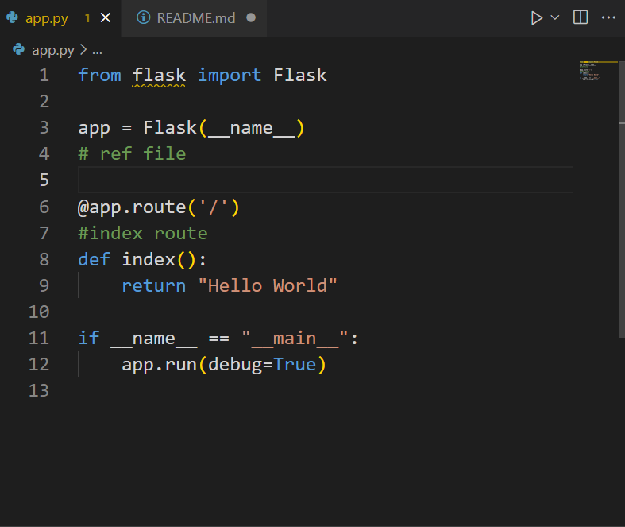
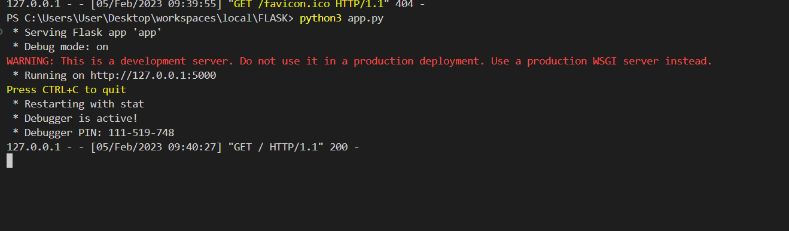
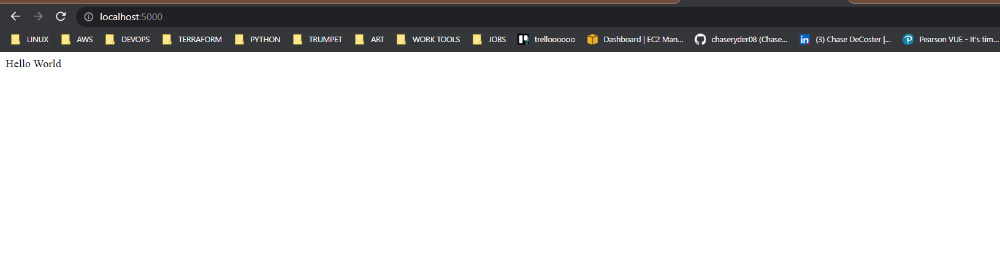
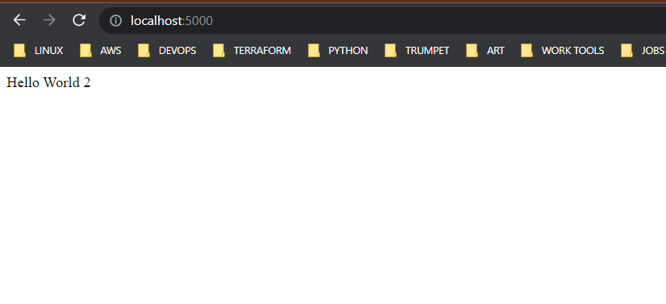
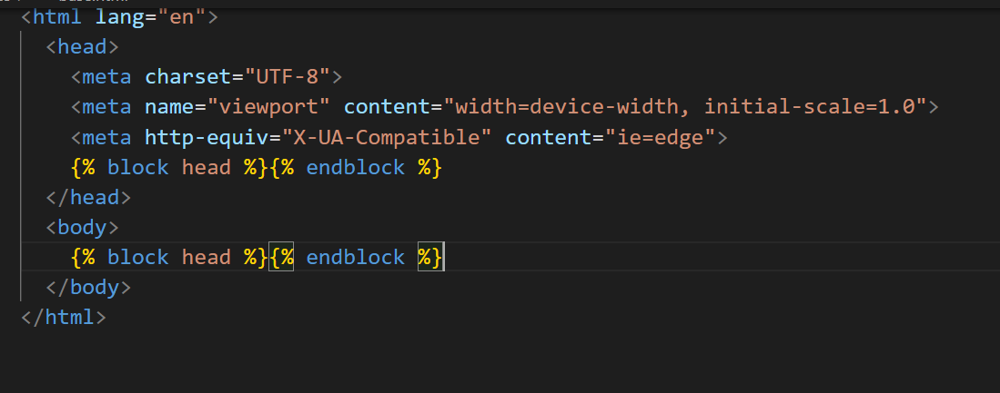
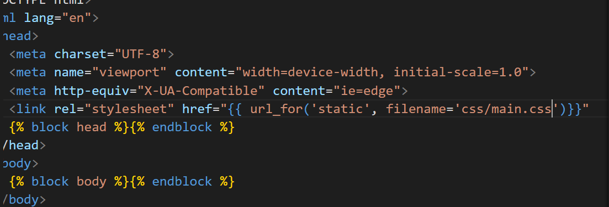

# FLASK PROJECT - TODO LIST

1) Install pip3 virtualenv -- 

<code> python3 -m venv myenv</code>  
<code>myenv\Scripts\activate.bat</code>
 
<code> pip3 install flask flask-sqlalchemy</code>  
<code>python3 app.py</code>

2) create new folder (static, templates)
3) import render_template
4) create index.html - return index

5) Template inheritence - create skeleton
   - one master html side
   - all have to do it once

6) Create css file, link to HTML file as so:

7) Initialize DB ( import from flask_sqlcademy)
8) Create Todo class 
- create ID column of each entry 
- text column - what holds each task
- date time when created auto
- 
9) Create function to return string when create new element

